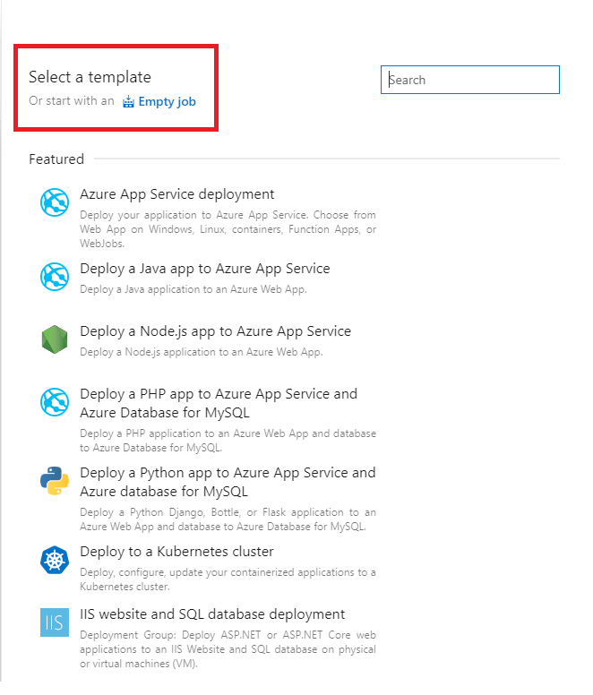
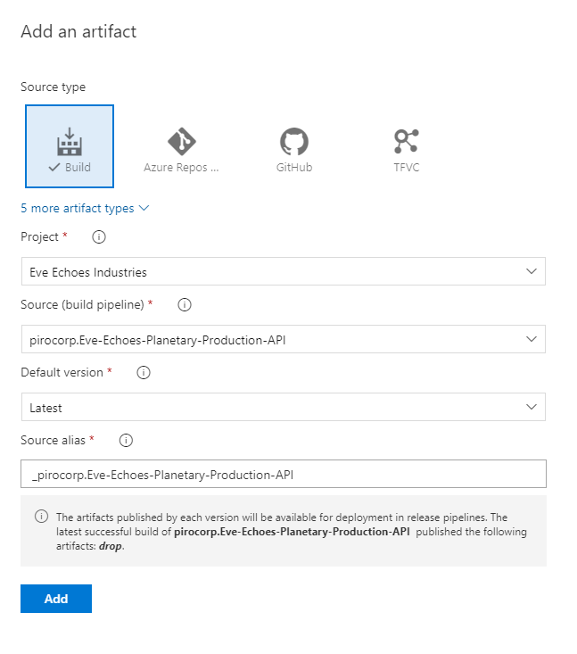
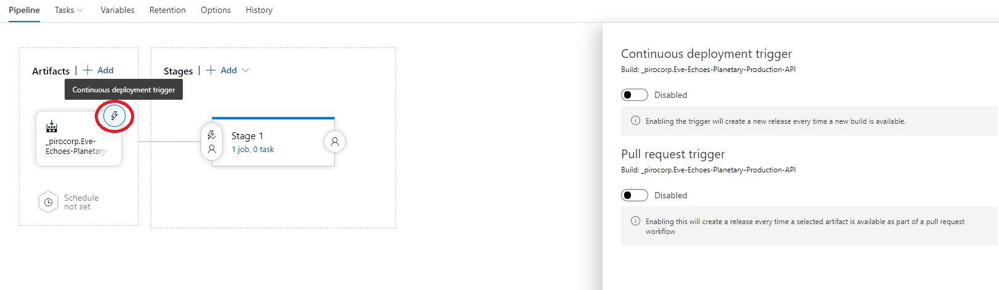
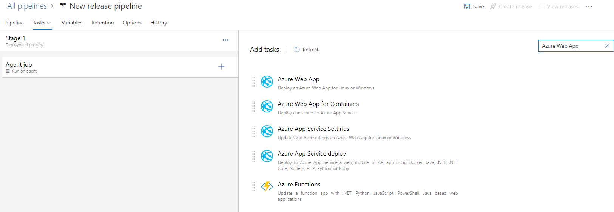
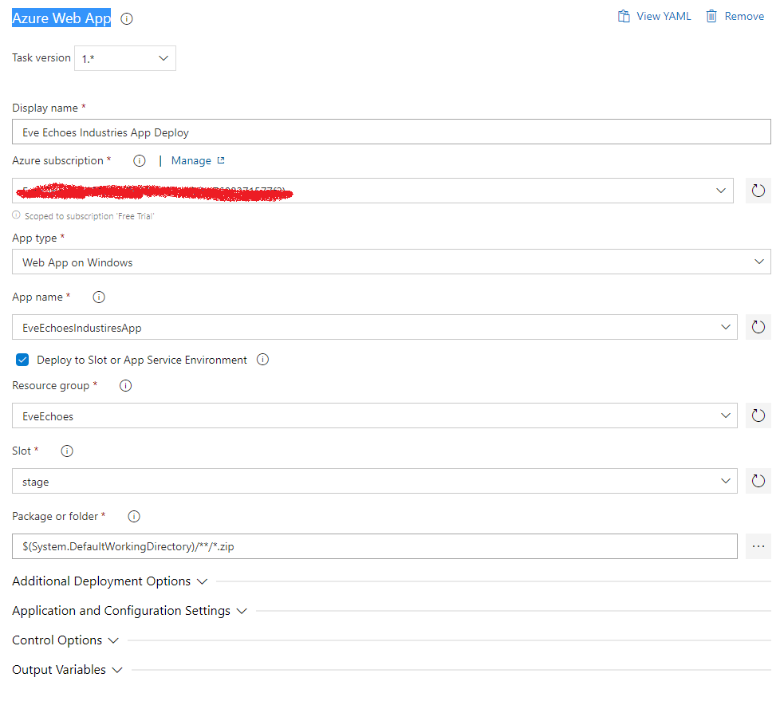

## How Configure CD To Deploy Blazor WASM Hosted Application

### Step 1: Create New Release Pipeline

### Step 2: For Select Template Choose: Or start with an Empty job



### Step 3: Add Artifacts


### Step 4: Select Artifacts Location



### Step 5: Configure Continuous Deployment Trigger



### Step 6: Select Azure Wep App



### Step 7: Azure Web App Configuration



### Step 8: Examing resulting yml file

[AzureWebApp@1](https://docs.microsoft.com/en-us/azure/devops/pipelines/tasks/deploy/azure-rm-web-app?view=azure-devops) Use this task to deploy web applications to Azure App service.

```yml
steps:
- task: AzureWebApp@1
  displayName: 'Eve Echoes Industries App Deploy'
  inputs:
    azureSubscription: $(azureSubscription)
    appType: webApp
    appName: EveEchoesIndustiresApp
    deployToSlotOrASE: true
    resourceGroupName: EveEchoes
    slotName: stage
```

Select the option to deploy to an existing deployment slot or Azure App Service Environment. Task needs resource group name. In case the deployment target is a slot, by default the deployment is done to the production slot.
Default value: false

```yml
deployToSlotOrASE: true
```

Name of the resource group

```yml
resourceGroupName: EveEchoes
```

Name of the slot
Default value: production

```yml
slotName: stage
```

### Result Deploy a release in slot stage every time a new build is available.
