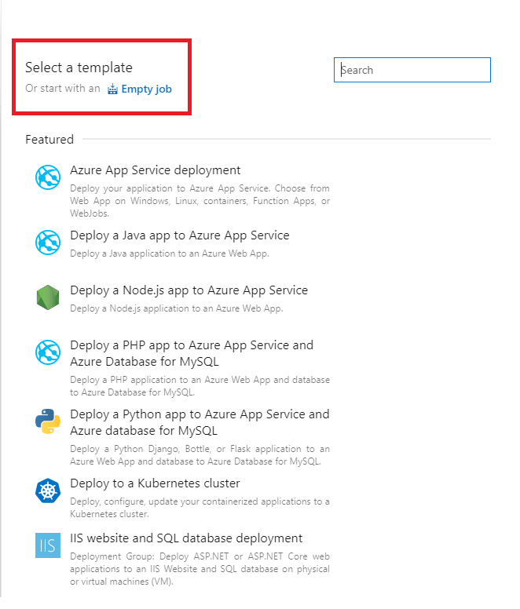
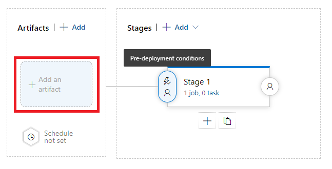

## How To Produce Yml File For CD To Deploy Blazor Wasm Hosted Application And

### Step 1: Create New Release Pipeline

### Step 2: For Select Template Choose: Or start with an Empty job

### Step 3: Add Artifacts

