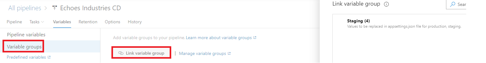

## Injecting the values for appsettings.json

### Create Variable group

Use **Library** to create variables for different environments. Click **Library** in the **Pipelines** menu, and click **+ Variable group**:


Update the group name to indicate which environment it is for. Then add variables based on the below rules:

- If the key is non-nested, use the same name as the key, eg. ```MyKey```.
- If the key is nested, like **ApiKey** in **SendGrid**, use JSONPath expressions to specify them, eg. ```SendGrid.ApiKey```.
- If there are spaces in the value, use quotation marks to wrap the value, eg ```"My appsettings.json Value"```.

So the variable group would be:


> **IMPORTANT**:
> If you store the database connection strings here, please make sure you click the **lock** icon to change it to secret. Otherwise, the value will show in the release logs. Or, you can use Azure KeyVault to store the secret data.

Now return to the release pipeline edit page and edit the tasks for one stage. Click the plus button on the right side of **Run on agent** then search transform:


Add the File transform task to the pipeline. Make sure it is before the deploy task. The configuration is shown below:


**File transform** is a task to apply file transformations and variable substitutions on configuration and parameters files. [For more detail: File transforms and variable substitution reference](https://docs.microsoft.com/en-us/azure/devops/pipelines/tasks/transforms-variable-substitution?view=azure-devops&tabs=Classic&WT.mc_id=DT-MVP-5001643).

Change the **Package or folder** based on your configuration in the artifact build pipeline. Select **JSON** as the **File format**. The **Target files** is ```**/appsettings.json```. This task will replace the corresponding key-value pairs according to the variable definitions. Next we need to link the variable group.

Click **Variables** tab and link the variable group:



Save the pipeline.

> Create another variable group and add the File transform task for another environment. You can easily Clone the variable group and update the values. 
> Because multiple variable groups can have the same keys, there is need to specify the variable group scope. In other words, the **Staging** variable group is only for **Stage**, and the **Production** variable group is only for **Production**:


